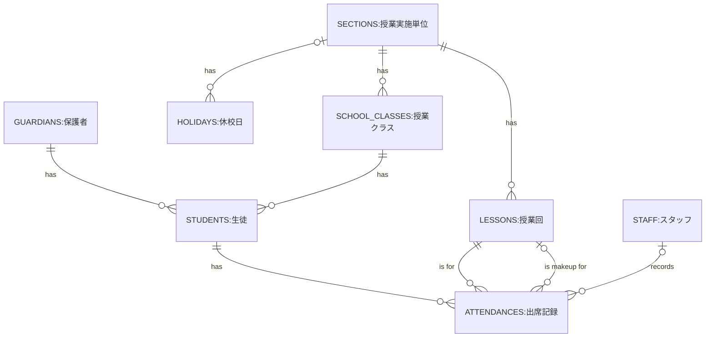

# テーブル定義書

- 作成日：2026-08-12
- 更新日：2026-08-17

## 1. テーブル一覧

| table | 説明 |
| --- | --- |
| students | 生徒 |
| guardians | 保護者|
| staff | スタッフ |
| holidays | 休校日 |
| school_classes | 授業クラス |
| lessons | 授業回 |
| sections | 授業実施単位 |
| attendances | 出席記録 |

---

## 2. テーブル定義

### students:生徒
| 列名 | 型 | NULL許可 | 制約 | 説明 |
| --- | --- | --- | --- | --- |
| id | integer | 不可 | PK | ID |
| guardian_id | integer | 不可 | FK → guardians.id | 保護者 |
| school_class_id | integer | 不可 | FK → school_classes.id | 授業クラス |
| grade | enum | 不可 |  | 学年   enum('年中','年長','小1','小2','小3','小4','小5','小6','中1','中2','中3') |
| gender | enum | 可 |  | 性別   enum('male','female')|
| name | string | 不可 |  | 名前 |
| name_kana | string | 不可 |  | 名前カナ |
| note | text | 可 |  | 特記事項 |
| leave_from | date | 可 |  | 休会開始日（選択した月の1日を保存。NULLなら休会なし） |
| leave_until | date | 可 |  | 休会終了日（選択した月の末日を保存。NULLなら終了月未定＝再開連絡があるまで休会継続） |
| created_at | timestamp | 不可 |  | 作成日時 |
| updated_at | timestamp | 不可 |  | 更新日時 |
| deleted_at | timestamp | 可 |  | 論理削除日時（NULLなら有効なレコード） |

### guardians:保護者
| 列名 | 型 | NULL許可 | 制約 | 説明 |
| --- | --- | --- | --- | --- |
| id | integer | 不可 | PK | ID |
| member_code | string | 不可 | UQ※ | 会員番号（ログインID。運営が発行。0001番台から採番） |
| name | string | 不可 |  | 名前 |
| name_kana | string | 可 |  | 名前カナ |
| email | string | 可 | UQ | メールアドレス（任意。パスワード再設定の連絡先。ログインには使用しない） |
| password | string | 不可 |  | パスワード、ハッシュ化して保存 |
| note | text | 可 |  | 特記事項 |
| created_at | timestamp | 不可 |  | 作成日時 |
| updated_at | timestamp | 不可 |  | 更新日時 |
| deleted_at | timestamp | 可 |  | 論理削除日時（NULLなら有効なレコード） |

### staff:スタッフ
| 列名 | 型 | NULL許可 | 制約 | 説明 |
| --- | --- | --- | --- | --- |
| id | integer | 不可 | PK | ID |
| member_code | string | 不可 | UQ※ | 会員番号（ログインID。運営（システム）が発行、本人からは編集不可。5001番台から採番） |
| name | string | 不可 |  | 名前 |
| name_kana | string | 不可 |  | 名前カナ |
| email | string | 可 | UQ | メールアドレス（任意。パスワード再設定の連絡先。ログインには使用しない） |
| password | string | 不可 |  | パスワード、ハッシュ化して保存 |
| role | enum | 不可 |  | ロール   enum('full_access','attendance_only') |
| note | text | 可 |  | 特記事項 |
| created_at | timestamp | 不可 |  | 作成日時 |
| updated_at | timestamp | 不可 |  | 更新日時 |
| deleted_at | timestamp | 可 |  | 論理削除日時（NULLなら有効なレコード） |

※guardians.member_codeとstaff.member_codeは、guardians／staffを合わせて1つの採番プールとして扱い、テーブルをまたいで重複しない番号を発行する（DB上のUQ制約はテーブル内のみだが、発行時のアプリケーションロジックで両テーブルの重複を防ぐ）。見分けやすくするため、保護者は0001番台、スタッフは5001番台から採番する（採番範囲を分けているだけで、重複禁止のルール自体はguardians／staff全体に適用される）。ログイン時は入力された会員番号でguardians・staff両方を検索し、一致した方のテーブルで認証する。

### holidays:休校日
| 列名 | 型 | NULL許可 | 制約 | 説明 |
| --- | --- | --- | --- | --- |
| id | integer | 不可 | PK | ID |
| section_id | integer | 可 | FK → sections.id | 授業実施単位 |
| date | date | 不可 |  | 日付 |
| reason | string | 不可 |  | 休校理由 |
| created_at | timestamp | 不可 |  | 作成日時 |
| updated_at | timestamp | 不可 |  | 更新日時 |

### school_classes:授業クラス
| 列名 | 型 | NULL許可 | 制約 | 説明 |
| --- | --- | --- | --- | --- |
| id | integer | 不可 | PK | ID |
| section_id | integer | 不可 | FK → sections.id | 授業実施単位 |
| code | string | 不可 | UQ | 内部コード |
| display_name | string | 不可 | UQ | 表示名 |
| created_at | timestamp | 不可 |  | 作成日時 |
| updated_at | timestamp | 不可 |  | 更新日時 |
| deleted_at | timestamp | 可 |  | 論理削除日時（NULLなら有効なレコード） |

### lessons:授業回
| 列名 | 型 | NULL許可 | 制約 | 説明 |
| --- | --- | --- | --- | --- |
| id | integer | 不可 | PK | ID |
| section_id | integer | 不可 | FK → sections.id | 授業実施単位 |
| no | integer | 不可 |  | 回数 |
| date | date | 不可 |  | 日付 |
| title | string | 可 |  | タイトル |
| created_at | timestamp | 不可 |  | 作成日時 |
| updated_at | timestamp | 不可 |  | 更新日時 |
| deleted_at | timestamp | 可 |  | 論理削除日時（NULLなら有効なレコード） |

複合UNIQUE制約：(section_id, no)

### sections:授業実施単位
| 列名 | 型 | NULL許可 | 制約 | 説明 |
| --- | --- | --- | --- | --- |
| id | integer | 不可 | PK | ID |
| name | string | 不可 |  | 授業実施単位名 |
| weekday | enum | 不可 |  | 曜日   enum('月','火','水','木','金','土','日') |
| start_time | time | 不可 |  | 開始時刻 |
| end_time | time | 不可 |  | 終了時刻 |
| created_at | timestamp | 不可 |  | 作成日時 |
| updated_at | timestamp | 不可 |  | 更新日時 |
| deleted_at | timestamp | 可 |  | 論理削除日時（NULLなら有効なレコード） |

### attendances:出席記録
| 列名 | 型 | NULL許可 | 制約 | 説明 |
| --- | --- | --- | --- | --- |
| id | integer | 不可 | PK | ID |
| student_id | integer | 不可 | FK → students.id | 生徒 |
| lesson_id | integer | 不可 | FK → lessons.id | 授業回 |
| makeup_lesson_id | integer | 可 | FK → lessons.id | 補講対象回 |
| staff_id | integer | 可 | FK → staff.id | 担当スタッフ（保護者が事前連絡した時点など、スタッフ未対応の間はNULL） |
| status | enum | 可 |  | 出席結果   enum('出席','欠席')|
| is_late | boolean | 不可 | default:false | 遅刻フラグ trueで遅刻 |
| makeup_type | enum | 可 |  | 補講予定   enum('振替','30分前補講','補講なし','未定') |
| note | text | 可 |  | 保護者からの連絡事項（欠席・遅刻・補講登録画面の自由記入欄。複数の生徒をまとめて連絡した場合は、同じ内容を各生徒のレコードに保存する） |
| created_at | timestamp | 不可 |  | 作成日時 |
| updated_at | timestamp | 不可 |  | 更新日時 |

複合UNIQUE制約：(student_id, lesson_id)

---

## 3. テーブル関連図

### 凡例

**カーディナリティ（関係性の記号）**

| 記号 | 意味 |
| --- | --- |
| `\|\|` | 1（必ず1つ） |
| `o\|` | 0または1 |
| `}o` | 0以上（多） |
| `}\|` | 1以上（多） |

`A <記号1>--<記号2> B`という書き方の場合、記号1（Aの隣）は「1つのBから見て、Aはいくつあるか」を、記号2（Bの隣）は「1つのAから見て、Bはいくつあるか」を表す。

**関係性のラベル**

| ラベル | 意味 |
| --- | --- |
| has | 親側が子側を持つ、という通常の親子関係 |
| is for | この出席記録が、どの授業回についてのものかという通常の紐付け（lesson_id） |
| is makeup for | 振替・30分前補講として選んだ授業回への紐付け（makeup_lesson_id） |
| records | この出席記録を記録した（対応した）担当スタッフへの紐付け（staff_id） |
