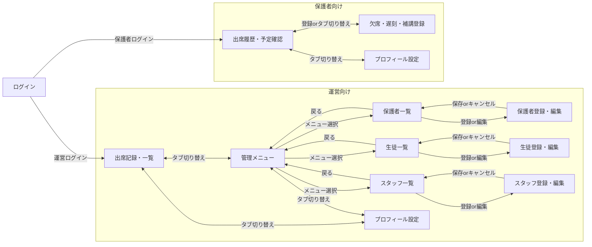

# 画面一覧・遷移図

- 作成日：2026-08-12
- 更新日：2026-08-13

## 画面一覧

### 運営向け画面

| 画面名 | アクセス可能な権限 |
| --- | --- |
| 出席記録・一覧画面 | full_access / attendance_only |
| 管理メニュー画面 | full_access |
| 保護者一覧画面 | full_access |
| 保護者登録・編集画面 | full_access |
| 生徒一覧画面 | full_access |
| 生徒登録・編集画面 | full_access |
| スタッフ一覧画面 | full_access |
| スタッフ登録・編集画面 | full_access |
| プロフィール設定画面 | full_access / attendance_only |

### 保護者向け画面

| 画面名 | アクセス可能な対象 |
| --- | --- |
| 出席履歴・予定確認画面 | 保護者 |
| 欠席・遅刻・補講登録画面 | 保護者 |
| プロフィール設定画面 | 保護者 |

### 運営・保護者共通画面

| 画面名 | アクセス可能な対象 |
| --- | --- |
| ログイン画面 | 運営・保護者 両方 |

## 画面遷移図

※運営向けのトップレベルタブは「出席記録・一覧／管理メニュー／プロフィール設定」の3つで、常にどこからでも切り替え可能（attendance_only権限の場合は「出席記録・一覧／プロフィール設定」の2タブのみ表示）

※保護者一覧／生徒一覧／スタッフ一覧の3画面はタブではなく、管理メニュー画面からの選択でアクセスする

※保護者向け画面（出席履歴・予定確認／欠席・遅刻・補講登録／プロフィール設定）は、タブ形式で常にどこからでも切り替え可能
